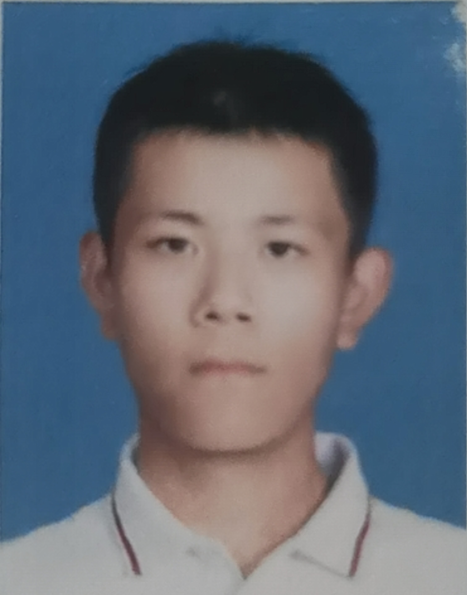

# Xianjie Shi

:link: Email: xianjieshi@smail.nju.edu.cn

:link: Github: [Bear-Go](https://github.com/Bear-Go)

:link: Resume: [Resume](CV.pdf) 

### About Me

I am Xianjie Shi (施贤杰), a junior in Computer Science and Technology (National Elite Program of Computer Science) at Nanjing University. My research interest lies in topics related to the reinforcement learning, multi-agent system and robotics. 

### Interests

Currently, my research interests specifically focus on how to optimize multi-agent collaboration under the framework of reinforcement learning and how to bridge the gap between multi-agent reinforcement learning in real and simulated environments.

If you are interested in this topic, please feel free to contact me. This will be of great help to me!

### Education

:mortar_board: Nanjing University - B.S. in Computer Science and Technology, 2020 ~ 2024 (expected)
